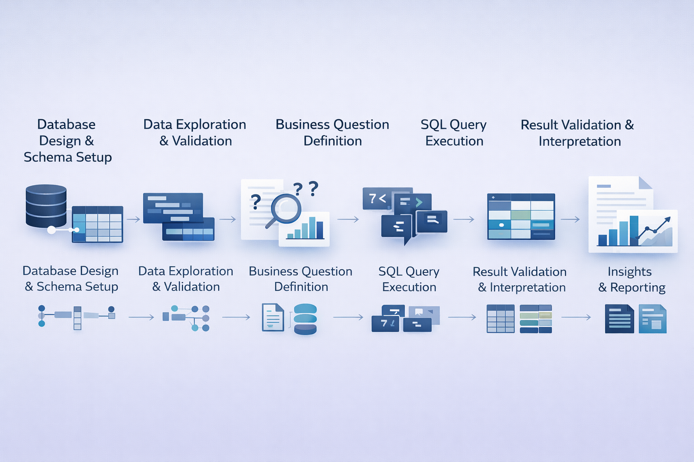
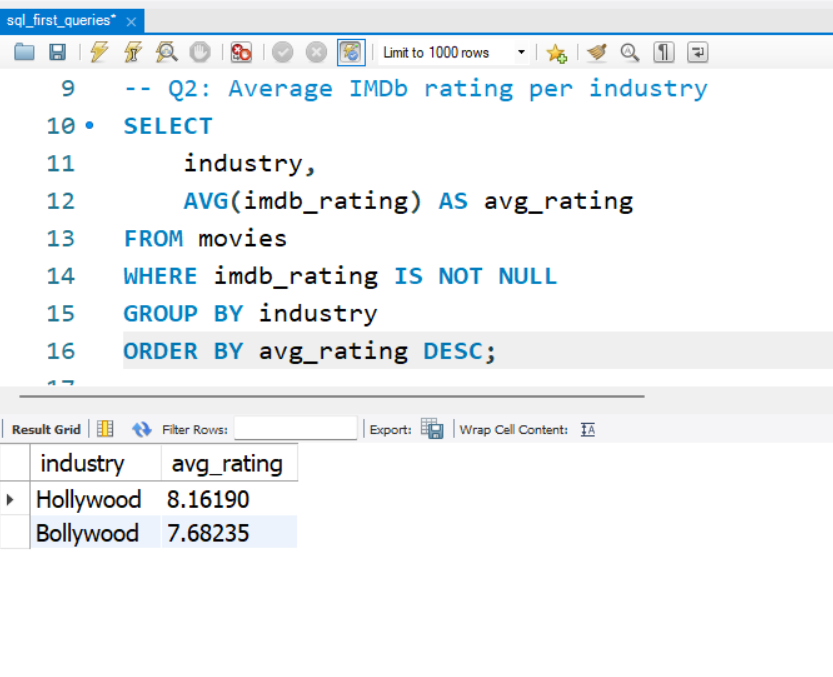
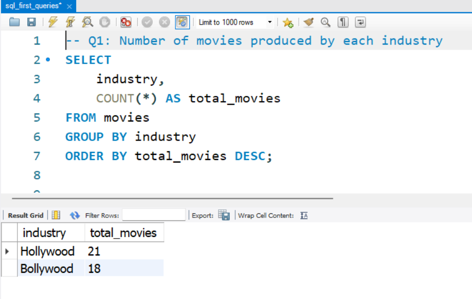
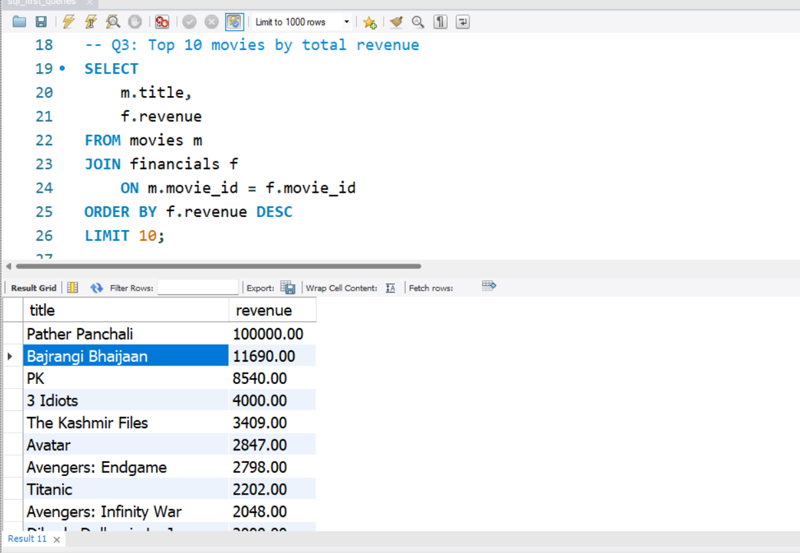
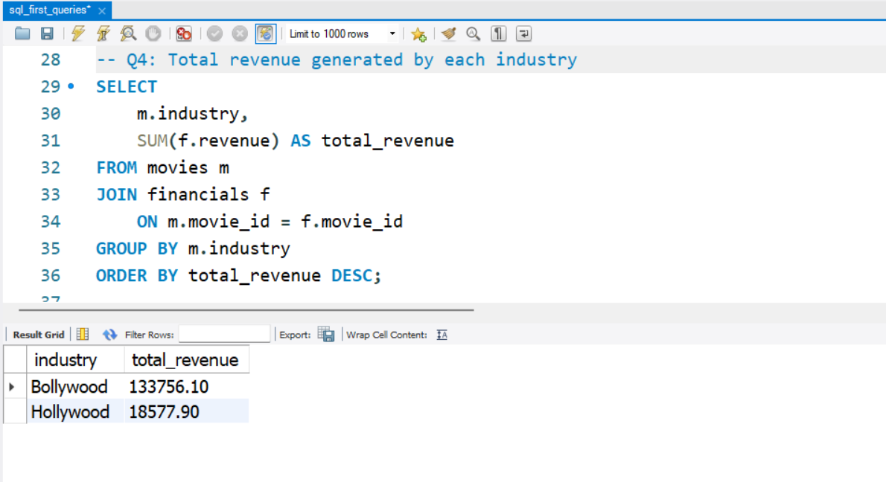
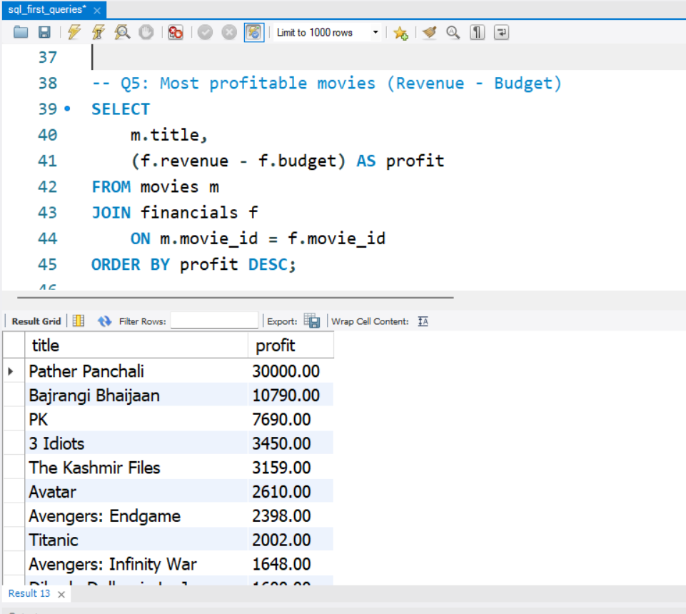
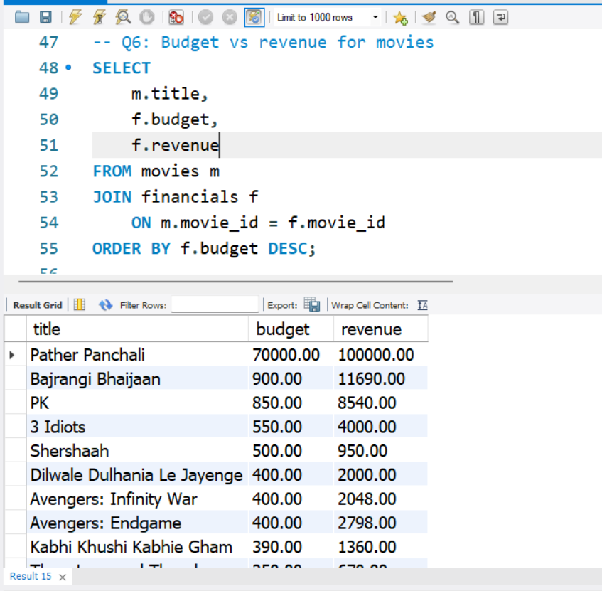
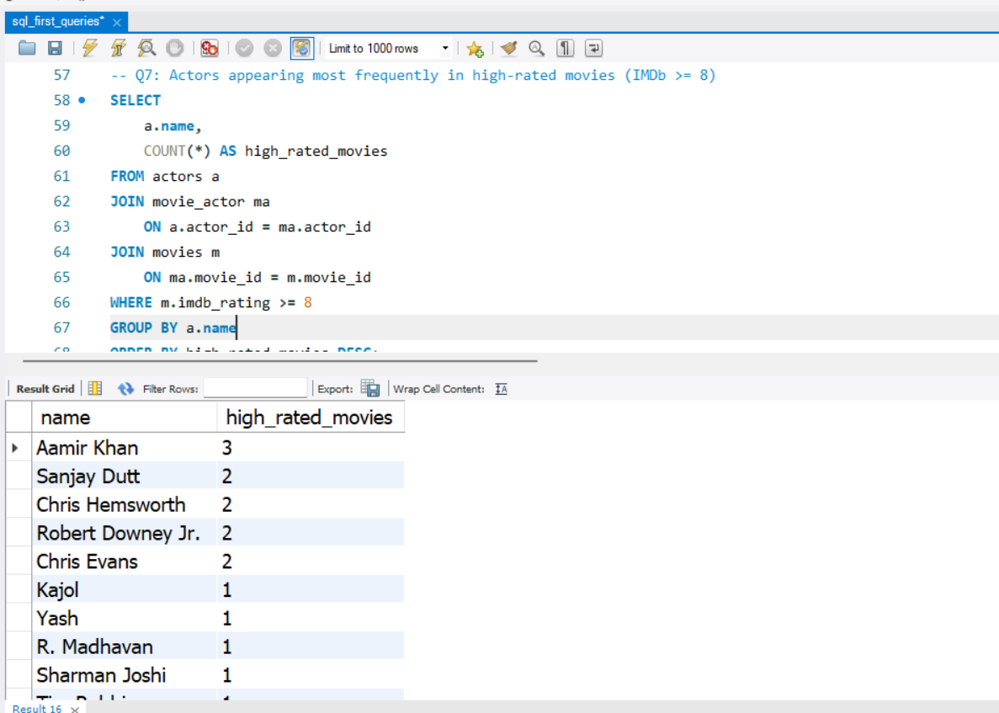
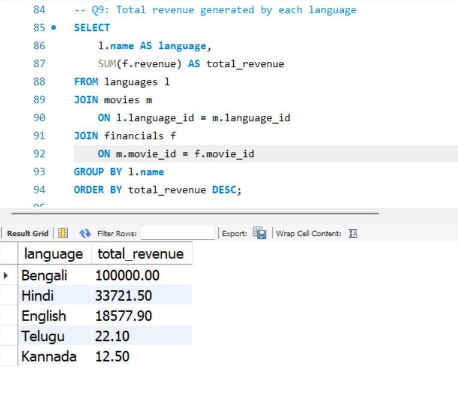

# 🧮 SQL Business Analysis – Movies Database
### SQL Basics: Filtering, Sorting & Aggregations
---
<p align="center">
  
</p>

---

## 📌 Project Overview

This project focuses on **exploring a relational database using SQL** to answer **realistic business questions** and extract **actionable insights**.

Using a structured **movies database**, the analysis demonstrates how SQL can be used to:
- Understand business performance  
- Compare industries and markets  
- Evaluate profitability and efficiency  
- Analyze trends and talent impact  

> 🎯 **Objective**  
> The goal of this task is not only to write SQL queries, but to **think like a Data Analyst** — translating raw data into insights that can support **business decisions**.

---

## 🛠 Tools & Technologies Used

- MySQL  
- MySQL Workbench  
- SQL (SELECT, JOIN, WHERE, GROUP BY, HAVING, ORDER BY)  

---

## 🗂 Project Structure

```text
movies-sql-analysis/
│
├── data/
│   └── moviesdb_schema.sql
│
├── queries/
│   └── queries_task3.sql
│
├── screenshots/
│   ├── Q1_movies_by_industry.png
│   ├── Q2_avg_rating_by_industry.png
│   ├── Q3_top_movies_by_revenue.png
│   ├── Q4_revenue_by_industry.png
│   ├── Q5_most_profitable_movies.png
│   ├── Q6_budget_vs_revenue.png
│   ├── Q7_high_rated_movies_by_actor.png
│   ├── Q8_actor_revenue_contribution.png
│   ├── Q9_revenue_by_language.png
│   └── Q10_movies_released_per_year.png
│
└── README.md
```
---
## 🧱 Dataset Description

The database consists of **five relational tables**, designed to support multi-dimensional business analysis:

- **movies** → movie details (title, industry, IMDb rating, release year, language)  
- **financials** → budget and revenue data  
- **actors** → actor information  
- **movie_actor** → many-to-many relationship between movies and actors  
- **languages** → language dimension table  

This relational structure enables **multi-table joins**, **aggregations**, and **dimensional analysis**, which are essential for real-world analytical workflows.

---
## 🔄 Analysis Workflow

This project follows a structured, end-to-end analytical workflow that mirrors how SQL is used in real business environments.

<p align="center">
  
</p>

**Workflow Steps:**

1. **Database Setup**  
   - Created a new database schema in MySQL.  
   - Defined table structures with appropriate data types.  
   - Established primary and foreign key relationships.

2. **Data Understanding & Validation**  
   - Explored each table using basic `SELECT` queries.  
   - Verified row counts and column integrity.  
   - Identified key dimensions and metrics.

3. **Business Question Formulation**  
   - Translated raw data availability into business-relevant questions.  
   - Focused on performance, profitability, trends, and market analysis.

4. **SQL Query Development**  
   - Wrote clean, well-commented SQL queries.  
   - Applied filtering (`WHERE`), aggregation (`COUNT`, `SUM`, `AVG`),  
     grouping (`GROUP BY`), and sorting (`ORDER BY`).  
   - Used multi-table `JOIN`s to connect relational data.

5. **Result Validation & Interpretation**  
   - Reviewed query outputs for accuracy and consistency.  
   - Interpreted results in a business context rather than just technical output.

6. **Insight Documentation**  
   - Captured query outputs as screenshots.  
   - Summarized findings into clear, actionable insights.  
   - Organized results for easy review by non-technical stakeholders.

> 💡 **Why this workflow matters**  
> This structured approach ensures reproducibility, clarity, and business relevance — key expectations for data analysts working with SQL.
---

## ❓ Business Questions Answered

### Q1. How many movies are produced by each industry?
<p align="center">
  
</p>

- Hollywood produces slightly more movies than Bollywood.  
- Production volume does not necessarily indicate higher revenue.

---

### Q2. What is the average IMDb rating per industry?
<p align="center">
  
</p>

- Hollywood movies have a higher average IMDb rating.  
- This suggests stronger audience perception or production quality.

---

### Q3. Which movies generated the highest revenue?
<p align="center">
  
</p>

- A small number of movies contribute a large share of total revenue.  
- Revenue distribution is highly skewed due to outliers.

---

### Q4. Which industries generate the highest total revenue?
<p align="center">
  
</p>

- Bollywood generates significantly higher total revenue than Hollywood.  
- This occurs despite Bollywood producing fewer movies on average.

---

### Q5. Which movies are the most profitable?
<p align="center">
  
</p>

- Profitability is calculated as **revenue − budget**.  
- Some low-budget movies deliver exceptionally high returns.

---

### Q6. Does a higher budget always lead to higher revenue?
<p align="center">
  
</p>

- Higher budgets do not guarantee proportional revenue growth.  
- This highlights the importance of efficiency and ROI, not just spending.

---

### Q7. Which actors appear most frequently in high-rated movies?
<p align="center">
  
</p>

- Certain actors consistently appear in highly rated films.  
- This highlights talent reliability rather than popularity alone.

---

### Q8. Which actors are associated with the highest total movie revenue?
<p align="center">
  
</p>

- Revenue contribution varies significantly among actors.  
- A few actors are linked to very high cumulative revenues.

---

### Q9. Which languages generate the highest total revenue?
<p align="center">
  
</p>

- Bengali and Hindi dominate total revenue.  
- English follows, while other languages contribute marginally.

---

### Q10. How has movie production changed over time?
<p align="center">
  
</p>

- Movie production shows noticeable growth in recent years.  
- This indicates increasing content creation and market expansion.

---

## 📈 Key Business Insights

- **Revenue ≠ Volume**: Producing more movies does not guarantee higher revenue.  
- **Profitability Matters**: Low-budget, high-return movies outperform expensive productions.  
- **Market Focus**: Language and regional focus strongly influence revenue generation.  
- **Talent Impact**: Certain actors consistently contribute to high-performing movies.  
- **Trend Awareness**: Recent years show increased movie production activity.

---

## 🚀 Skills Demonstrated

- SQL querying & joins  
- Data aggregation and filtering  
- Business-oriented analytical thinking  
- Translating raw data into insights  
- Understanding relational database design  

---

## 👤 Author

**Arao Zau Macaia**  
Data Analytics Intern | Electronics & Communication Engineering  

### 🎓 Context
This project was completed as part of a **Data Analytics Internship**, with a strong focus on analytical thinking, structured problem-solving, and business insight generation.

### 🔗 Connect with me
- **LinkedIn:** *https://www.linkedin.com/in/araomacaia/*  
- **GitHub:** *https://github.com/araomacaia*
